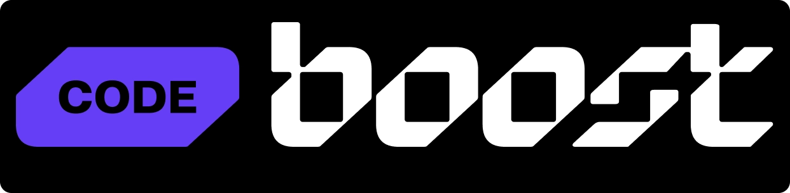

# CODEBOOST

# Font-end de forma simples e descomplicada.

  
  
  
  
  
  
  
  
  
  
  

   

# HTML5 & CSS3: +5hrs

  

    Aprenda a desenvolver interfaces de alta qualidade através de uma metodologia simples e com exemplos práticos.  
    Ideal pra quem deseja conquistar uma nova habilidade.  
    Domine as principais técnicas para se tornar um front-end capaz de codificar qualquer tipo de layout.  
    <b>HTML5, CSS3 / SASS, JS</b>.
  

## PROJETOS

## Wireframeboost / Structboost

  

    Projeto para se adaptar com Figma e colocar em prática HTML5 e CSS3.  
    Utilizando conceitos como handoff, exportação de assets, utilização de tokens, estrutura de pastas, cheats no VSCode, HTML5 semântico,  e CSS3, variáveis no CSS3, flexbox e css grid, responsividade.  
  

     

# Sass: +10hrs

  Aprofundamento nas tecnologias como CSS flexbox / grid e SASS  

- **Fundamentos no compilador Sass:** . 
- **Introdução ao HTML5, CSS3 e JS:** . 
- **AOS animate** . 
- **Meta tags de compartilhamento** . 
- **Git & Github:** . 
- **Deploy github pags:** . 

## PROJETOS

## LP Cloudboost

  Landing page de apresentação de um serviço de cloud.  
  Prática dos conceitos vistos nas aulas de Sass e muito mais.  

 

## LP Banco Neon / Bank Boost

  Landing page de apresentação do banco Neon / boost e seus beneficios.  
  Com design / layout incrível e diferenciado. Utilizabdo tecnologias e técnicas modernas.  

   

# WordPress: +20hrs

  Curso <b>WordPress</b> do zero ao avançado.  
  Aprendendo a criar um blog  sem template, controle absoluto do código.  

- **Fundamentos do WordPress:** . 
- **Instalando wPs local e config. deo tema, get header / footer e demais infos:** . 
- **Gerenciando menu e mais:** . 
- **Construindo layout e ACF:** . 
- **Plugins de performance e segurança:** . 
- **Redux + Zustand:** . 
- **TailwindCSS:** . 

## PROJETOS

## Banco Neon / Bank Boost

  Colocando em prática os conceitos vistos neste módulo, na construção da lp banco Neon / Bank Boost.  

   

# JS: +7hrs

  Curso <b>JS</b> do zero ao avançado.  

- **Fundamentos do JS:** . 
- **DOM, Eventos, e mais:** . 
- **Mini projetos para práticar os conceitos (Nav tabs, Accordion, Scroll smoothing, Modal, Drop down e mais):** . 
- **Consumindo API REST com JS:** . 
- **API NodeJS com SOLID:** . 
- **DDD no NodeJS:** . 
- **NestJS:** . 

## PROJETOS

## Pokémon

  Landing page consumindo PokéAPI.  

   

# React / NextJS + TailwindCSS: +14hrs

  Curso <b>React / NextJS + TailwindCSS</b> do zero ao avançado.  

- **Fundamentos do React / NextJS + TailwindCSS:** . 
- **Vite, Components, props, children, hooks:** . 
- **CSS / styled-components:** . 
- **React Router DOM:** . 
- **React Form + Yup:** . 
- **Consumindo AOI:** . 
- **Intro a estrutura de pastas:** . 
- **Rotas:** . 
- **Server-components:** . 
- **SSG, CRC, SSC:** . 
- **Configurando TailwindCSS e Fundamentos:** . 
- **Mobile first e media queries:** . 

## PROJETOS

## NFTboost

  Landing page de NFT, práticando conceitos aprendidos neste módulo.  

   
