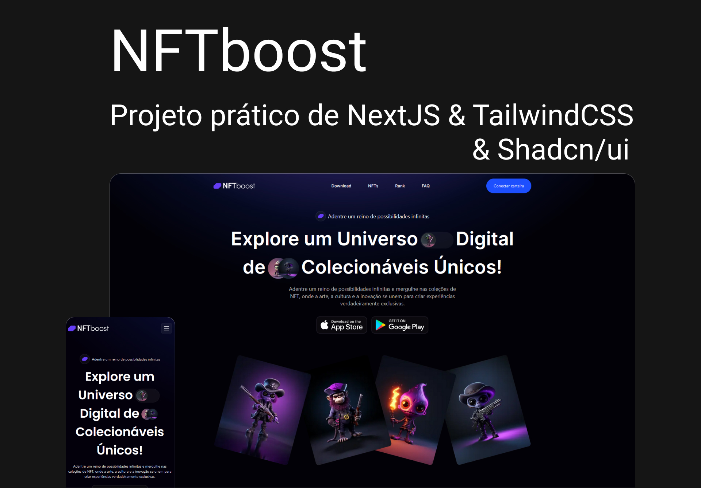

# CODEBOOST - NextJS + TailwindCSS + Shadcn/UI

<div>
  
  
</div>
<br /> <br />



# ⚡ Overview

<b>NFTboost</b>: Utilizei técnicas modernas de desenvolvimento, priorizando design e performance.

## Features:

- HTML5 Semântico
- CSS3 moderno
- NextJS14
- TailwindCSS
- Shadcn/UI / accordion
- SwiperJS / slides
- Totalmente responsivo
- SEO otimizado
- Performance otimizado
- Boas práticas
- Acessibilidade
- W3C validação
- Lib AOS JS
- Motion Design
- Imagens IA generate
- Animações suaves
- Animações suaves com Scroll
- Página com carregamento rápido
- Layout Clean e Moderno
- Page Home
- Page Style Guide

# 📚 Aprendizados

Criar animações suaves e intercaladas com cards (Motion Design). <br />
Organizar as informações e elementos visuais de forma simples, intuitiva e agradável, baseando em estudos, mantendo a consistência de estilos.
<br /><br />

# 🚀 Deploy

[Ver online](https://diogorealles.github.io/)

## Clone

```
git clone git@github.com:DiogoRealles/git
```

<p>Gostou? deixa seu like!</p>
<p>Estou disponível para realizar seus projetos</p>

<!--
<a href="mailto:diogorealles@hotmail.com"></a>
-->

<a href="https://www.linkedin.com/in/diogorealles/"></a>

<p><strong>

[Diogo Realles](https://diogorealles.github.io/) | 2025
</strong></p>
