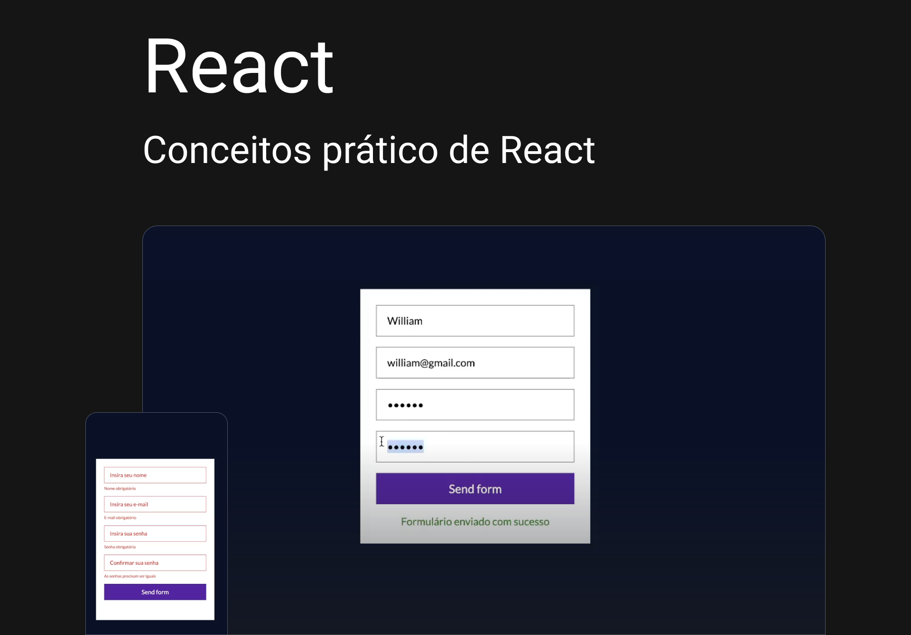

# CODEBOOST - React & styled-components & React Hook Form + YUP

<div>
  
</div>
<br /> <br />



# ⚡ Overview

<b>React</b>: Utilizei técnicas modernas de desenvolvimento, priorizando design e performance.

## Features:

- Intro React + Vite
- eventos e Components + Props
- hooks (useState, useEffect, useRef, useContext e mais)
- states e hooks com (input, textarea, select, radio, checkbox, )
- import image
- map no react
- CSS import / modules
- styled-components e props
- React Router DOM + Link
- React Hook Form + YUP
- Consumindo API

# 📚 Aprendizados

Criar animações suaves e intercaladas com cards (Motion Design). <br />
Organizar as informações e elementos visuais de forma simples, intuitiva e agradável, baseando em estudos, mantendo a consistência de estilos.
<br /><br />

# 🚀 Deploy

[Ver online](https://diogorealles.github.io/)

## Clone

```
git clone git@github.com:DiogoRealles/git
```

<p>Gostou? deixa seu like!</p>
<p>Estou disponível para realizar seus projetos</p>

<!--
<a href="mailto:diogorealles@hotmail.com"></a>
-->

<a href="https://www.linkedin.com/in/diogorealles/"></a>

<p><strong>
  
  [Diogo Realles](https://diogorealles.github.io/) | 2025
  </strong></p>
